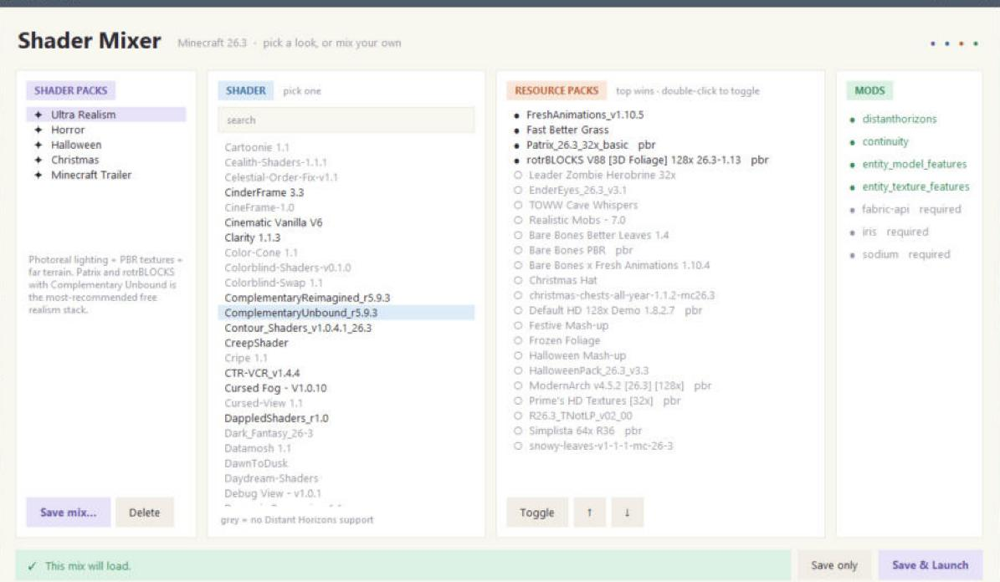

# Shader Mixer

Pick a look for Minecraft (realistic, horror, Halloween, Christmas, or the official trailer style), or mix your own from 190+ shaders and a shelf of resource packs. Shader Mixer checks every combination first and **won't launch one that is going to break**.



## Install

You need **Windows 10 or 11** and **Minecraft: Java Edition** (bought on your Microsoft account).

1. **Run Minecraft 26.3 once.** Open the Minecraft Launcher, play 26.3 until you reach the title screen, then close the game *and* the launcher.
2. **Download Shader Mixer.** On this page, click the green **Code** button, then **Download ZIP**. Right-click the ZIP and choose **Extract All…**. Put the folder somewhere permanent, such as `Documents`; the shortcut points there.
3. **Double-click `install.bat`.**
   - If Python isn't installed, it offers to install it for you. Say yes, then double-click `install.bat` again when it finishes.
   - The first run downloads about 1 GB of mods, shaders and packs, which takes a few minutes.
   - If Windows shows "Windows protected your PC", click **More info**, then **Run anyway**. The script is plain text, so you can open it in Notepad first.
4. **Open "Shader Mixer"** from your desktop or Start menu.

To update everything later, double-click `install.bat` again.

## Play

1. Pick a **shader pack** on the left, or build your own mix.
2. Click **Save & Launch**. The Minecraft Launcher opens.
3. In the launcher, choose the **Shader Mixer** profile and press **Play**.

The Shader Mixer profile also works straight from the Minecraft Launcher, using whatever you saved last. Your normal Minecraft worlds and settings aren't touched; Shader Mixer has its own game folder (`%APPDATA%\.shader-mixer`).

## Shader packs

| Pack | Shader | Resource packs (top wins) | Notes |
|---|---|---|---|
| ✦ Ultra Realism | Complementary Unbound | Fresh Animations, Fast Better Grass, Patrix 32x, rotrBLOCKS 128x | PBR textures, far terrain with Distant Horizons |
| ✦ Horror | Spooklementary | Herobrine-led zombies, Blinking Ender Eyes, The One Who Watches cave whispers, Realistic Mobs, Patrix 32x | Thick fog and dark caves; Distant Horizons off so the fog closes in |
| ✦ Halloween | Complementary Reimagined | The Night of the Living Pumpkins, Default-style Halloween, Mojang's Halloween Mash-up, Fresh Animations | Stylized, not realistic |
| ✦ Christmas | BSL | Christmas Hat, Christmas Chests All Year, Snowy Leaves, Frozen Foliage, Mojang's Festive Mash-up, Fresh Animations | Winter wonderland |
| ✦ Minecraft Trailer | BSL | Bare Bones × Fresh Animations, Fresh Animations, Bare Bones Better Leaves, Bare Bones | The community "Trailer Vibes" recipe for Mojang's promo look |

**Your own mixes:** choose a shader, toggle resource packs (double-click) and order them with ↑ ↓, then click **Save mix…** and name it. Only mixes that pass the checks can be saved. **Delete** removes your own mixes; the five above stay.

## What gets refused

The checks read the files themselves, so packs you add later are covered too.

| Problem | How Shader Mixer knows |
|---|---|
| Resource pack made for a different game version | `pack.mcmeta` format range vs. the game's own `version.json` |
| Pack needs a mod that's switched off | Zip contents: connected textures need Continuity, custom entity models need Entity Model Features, random/emissive mobs need Entity Texture Features |
| Pack uses OptiFine custom skies | `optifine/sky/`; nothing on 26.3 with Iris can draw them |
| Shader lacks Distant Horizons support while it's on | Looks for `dh_*` programs in the shader (unsupported shaders show in grey) |
| Shader needs Iris features this Iris lacks | `iris.features.required` vs. the feature list inside the installed Iris jar |
| Mod missing a dependency | Each mod's `fabric.mod.json` |

PBR packs without a shader only get a warning, because the game still loads.

## What's installed

- **Mods:** Fabric Loader, Fabric API, Sodium (performance), Iris (shaders), Distant Horizons (far terrain), Continuity, Entity Model Features and Entity Texture Features
- **Shaders:** every shader on Modrinth with a 26.3 build
- **Resource packs:** realism (Patrix, rotrBLOCKS, ModernArch, Default HD, Prime's HD, Simplista) plus the themed packs listed above
- **Launcher profile:** "Shader Mixer", with 8 GB of memory and ZGC for smooth frame pacing

Lots of shaders? Use the search box. For more FPS, lower the shader profile in game (press `O`) or switch off Distant Horizons.

## Security

- Downloads come only from Modrinth's CDN over HTTPS, and each file's SHA-512 is checked before it's saved
- Filenames from the API are rejected if they contain folders, so a file can't land outside the game folder
- Zip files are read, never extracted
- No shell strings; the launcher is opened with fixed arguments
- `bandit -r .` reports no medium- or high-severity issues

## For developers

```bash
python setup.py                  # what install.bat runs
python shader-mixer.pyw          # the app
python shader-mixer.pyw --selftest
```

Plain Python 3.11+ with no dependencies; the UI is Tkinter. The built-in packs live in [`presets.json`](presets.json) and refer to Modrinth project slugs, so they still match after updates. Mods are switched on and off by renaming `.jar` to `.jar.disabled`, so nothing gets deleted.

## License

[MIT](LICENSE). Shaders, resource packs and mods are downloaded from their authors' Modrinth pages under their own licenses and are not redistributed here.
