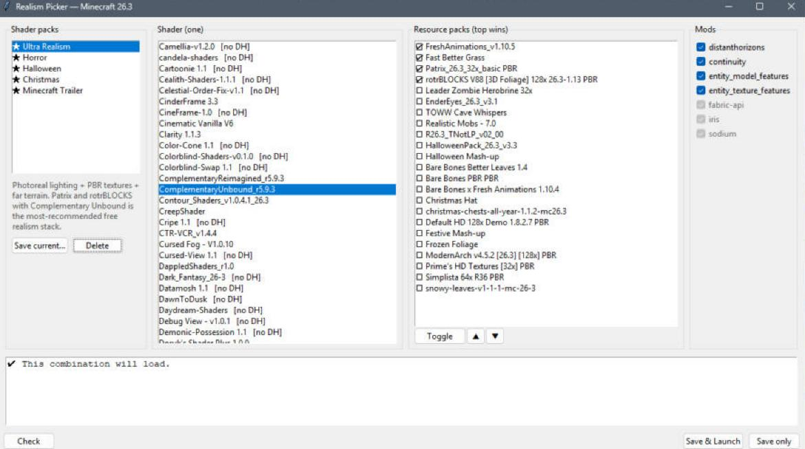

# Realism Picker for Minecraft

A one-command installer and a small desktop app for experimenting with **shaders, resource packs and rendering mods** on the newest Minecraft Java release (26.3). Before anything launches, the app checks the combination you picked and **refuses combinations that won't load or render correctly**.



## What it does

- **`setup.py`** builds an isolated Fabric install (`%APPDATA%\.minecraft-ultra`) without touching your normal worlds or settings:
  - Fabric Loader, Fabric API, **Sodium** (performance), **Iris** (shaders), **Distant Horizons** (far-terrain LODs), Continuity, Entity Model/Texture Features
  - **Every shader on Modrinth with a 26.3 build** (190+ at the time of writing), including Complementary Unbound/Reimagined, Bliss, BSL, Noble and Sildur's
  - Curated realism resource packs: Patrix 32x, rotrBLOCKS 128x (3D foliage), ModernArch 128x, Default HD 128x, Prime's HD, Simplista, Fresh Animations and Fast Better Grass
  - Themed packs for the built-in shader packs: Bare Bones, Mojang's Halloween and Festive Mash-ups, horror mobs and cave sounds, Christmas extras
  - A profile named **"Ultra Realism (shaders)"** in the official Minecraft Launcher, with 8 GB of heap and ZGC for smooth frame pacing
- **`picker.pyw`** is a Tkinter GUI where you pick one shader, an ordered stack of resource packs and the optional mods. It validates the combination, writes the game config, and opens the launcher.

## Shader packs (presets)

One click sets the shader, the pack order and the mods. Every combination was researched from popular community setups and runs through the same compatibility checker before it ships.

| Pack | Shader | Resource packs (top wins) | Notes |
|---|---|---|---|
| ★ Ultra Realism | Complementary Unbound | Fresh Animations, Fast Better Grass, Patrix 32x, rotrBLOCKS 128x | PBR textures, Distant Horizons on |
| ★ Horror | Spooklementary | Herobrine-led zombies, Blinking Ender Eyes, The One Who Watches cave whispers, Realistic Mobs, Patrix 32x | Heavy fog and dark caves; Distant Horizons off so the fog closes in |
| ★ Halloween | Complementary Reimagined | The Night of the Living Pumpkins, Default-style Halloween, Mojang's Halloween Mash-up, Fresh Animations | Stylized, not realistic |
| ★ Christmas | BSL | Christmas Hat, Christmas Chests All Year, Snowy Leaves, Frozen Foliage, Mojang's Festive Mash-up, Fresh Animations | Winter wonderland |
| ★ Minecraft Trailer | BSL | Bare Bones × Fresh Animations, Fresh Animations, Bare Bones Better Leaves, Bare Bones | The community "Trailer Vibes" recipe for Mojang's promo look |

**Make your own:** set up any combination, click **Save current…** and name it. Only combinations that pass the checker can be saved. Your packs are stored in `%APPDATA%\.minecraft-ultra\my_presets.json`, and **Delete** removes them. Built-in packs live in [`presets.json`](presets.json) and refer to Modrinth project slugs, so they still match after setup updates a file.

## Compatibility rules (why a combination gets refused)

The rules come from the files themselves, not from a hand-maintained list, so packs and shaders you add yourself are checked too:

| Rule | How it is detected |
|---|---|
| Resource pack format must match the game | `pack.mcmeta` `min_format`/`max_format` (and the legacy `supported_formats`/`pack_format`) compared with `pack_version` in the game's own `version.json` |
| Pack content needs a mod that is turned off | Zip contents: `optifine/ctm` needs Continuity, CEM/EMF needs Entity Model Features, random/emissive textures need Entity Texture Features |
| Shader without Distant Horizons support while DH is on | Checks the shader zip for `dh_*` programs |
| Shader needs Iris features this Iris build lacks | `iris.features.required` in `shaders.properties`, compared with the `FeatureFlags` enum read out of the installed Iris jar |
| Mod dependencies | Each jar's `fabric.mod.json` `depends`/`provides` |
| OptiFine custom skies | `optifine/sky/` in a pack; nothing for 26.3 + Iris renders them |

PBR texture maps used without a shader produce a warning instead of a refusal, because the game still loads.

## Usage

```bash
python setup.py          # install or update everything (rerun anytime)
python picker.pyw        # choose, validate, launch
python picker.pyw --selftest
```

Requirements: Windows, Python 3.11+ (Tkinter included), a Microsoft account that owns Minecraft Java, and the official launcher installed with 26.3 run once.

Three ways to play:
1. **Picker → "Save & Launch"** applies your choice and opens the launcher. Select *Ultra Realism (shaders)* and press Play.
2. **The official launcher directly** uses whatever you last saved in the picker.
3. **In game**: the Iris shader menu (`O`) and the resource pack screen work as usual. These bypass the picker's checks.

The default **Ultra Realism** pack was tuned on an RTX 3080. For more FPS, lower the shader profile in the Iris menu or turn Distant Horizons off.

## Security

- Downloads use **HTTPS only**, come only from `cdn.modrinth.com`, and each file's **SHA-512 is checked** against the hash Modrinth publishes before it is written
- Filenames from the API are rejected if they contain path components (no path traversal)
- Archives are **listed, never extracted**; the app reads metadata only
- No shell strings; the launcher is started with fixed arguments
- Static analysis: `bandit -r .` reports no medium- or high-severity issues

## Design notes

- Mods are switched on and off by renaming `x.jar` ↔ `x.jar.disabled`, which Fabric ignores natively, so nothing gets deleted
- `installed.json` tracks which file came from which Modrinth project, so updates replace exactly the old build
- Stable releases are preferred over alpha and beta builds when both exist
- Resource packs with no 26.3 tag fall back to their newest build; the format check then decides whether they're allowed. The checker caught two packs tagged 26.3 that were actually built for older pack formats, and they were left out of the presets

## License

[MIT](LICENSE). Shaders, resource packs and mods are downloaded from their authors' Modrinth pages under their own licenses and are not redistributed here.
